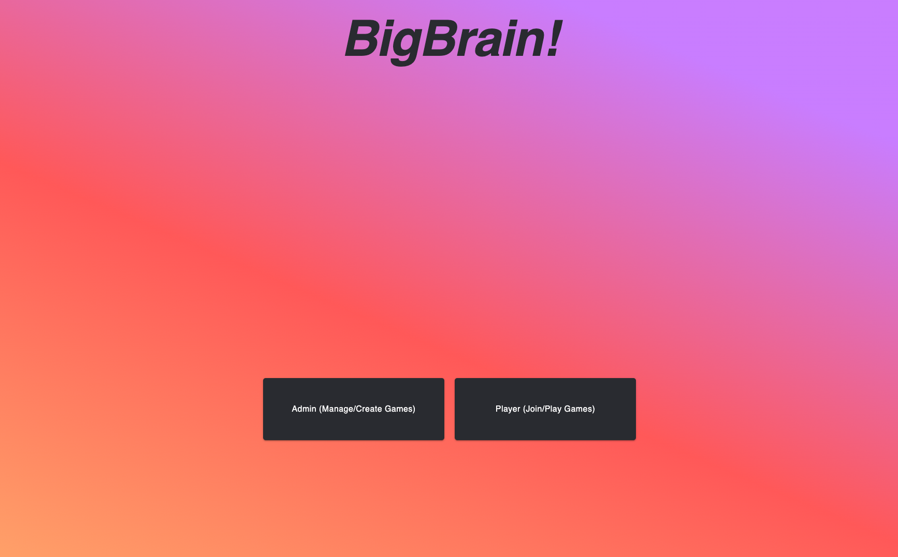
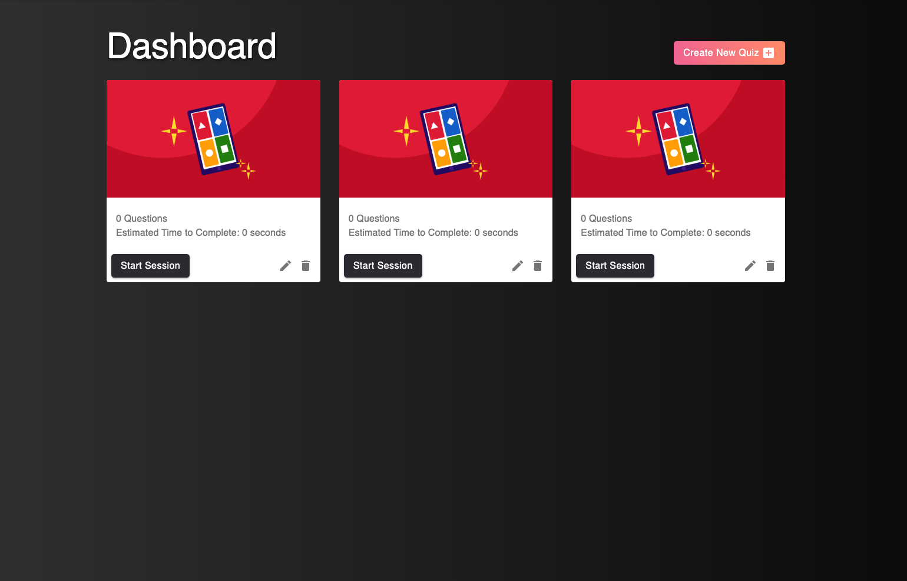
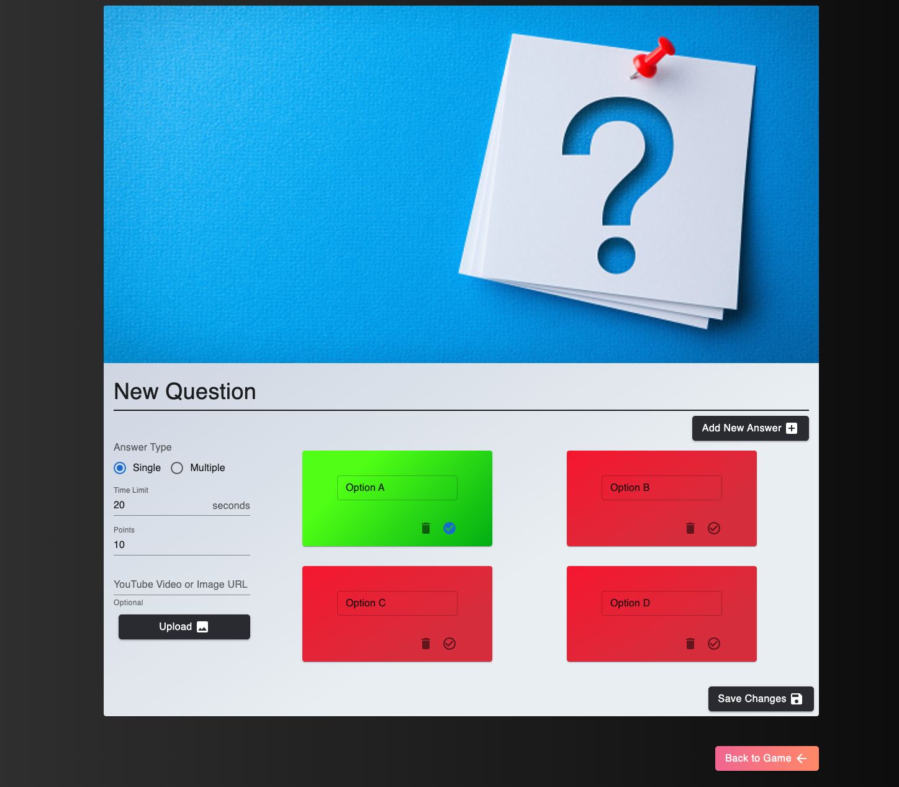

# BigBrain - A Kahoot Clone
This project is based off the popular game [kahoot](https://kahoot.com/).

To run this project, clone the reponsitory and run both the backend and frontend servers as following:
```
npm start in /backend and /frontend
```

# Demo Screenshots




<!-- You will _need_ to watch at least the following lectures before starting (it will help you get started):
 * [Javascript Ecosystem](https://cgi.cse.unsw.edu.au/~cs6080/23T1/content/lectures/javascript-ecosystem)
 * [Node Package Manager](https://cgi.cse.unsw.edu.au/~cs6080/23T1/content/lectures/javascript-npm)
 * [ReactJS Introduction](https://cgi.cse.unsw.edu.au/~cs6080/23T1/content/lectures/react-intro)
 * [ReactJS Global CSS Usage](https://cgi.cse.unsw.edu.au/~cs6080/23T1/content/lectures/react-css-basic)
 * [ReactJS Lifecycle](https://cgi.cse.unsw.edu.au/~cs6080/23T1/content/lectures/react-lifecycle)
 * [ReactJS useState hook](https://cgi.cse.unsw.edu.au/~cs6080/23T1/content/lectures/react-hooks-state)
 * [ReactJS useEffect hook](https://cgi.cse.unsw.edu.au/~cs6080/23T1/content/lectures/react-hooks-effect)
 * [Working with multiple files](https://cgi.cse.unsw.edu.au/~cs6080/23T1/content/lectures/multi-file-import)
 * [Components & Props](https://cgi.cse.unsw.edu.au/~cs6080/23T1/content/lectures/react-components-props)
 * [Linting](https://cgi.cse.unsw.edu.au/~cs6080/23T1/content/lectures/javascript-linting)

You will _need_ to watch at least the following lectures to finish the assessment completely:
 * [Routing & SPAs](https://cgi.cse.unsw.edu.au/~cs6080/23T1/content/lectures/react-routing-spas)
 * [CSS Frameworks](https://cgi.cse.unsw.edu.au/~cs6080/23T1/content/lectures/react-css-frameworks)
 * [useContext hook](https://cgi.cse.unsw.edu.au/~cs6080/23T1/content/lectures/react-hooks-context)
 * [Testing introduction](https://cgi.cse.unsw.edu.au/~cs6080/23T1/content/lectures/testing-intro)
 * [Component testing](https://cgi.cse.unsw.edu.au/~cs6080/23T1/content/lectures/testing-components)
 * [UI Testing](https://cgi.cse.unsw.edu.au/~cs6080/23T1/content/lectures/testing-ui) -->

## Features Implemented

### 2.1. Feature 1. Admin Auth 

#### 2.1.1. Login Screen
 * A unique route must exist for this screen
 * User must be able to enter their `email` and `password`.
 * If the form submission fails, a reasonable error message is shown
 * A button must exist to allow submission of form

#### 2.1.2. Register Screen
 * A unique route must exist for this screen
 * User must be able to enter their `email` and `password` and `name`
 * A button must exist to allow submission of form

#### 2.1.3. Logout Button
 * On all screens that require an authorised user, a logout button exists.
 * This logout button, when clicked, returns you to the login screen.

### 2.2. Feature 2. Admin Creating & Editing a Game 

#### 2.2.1. Dashboard
 * A unique route must exist for this screen
 * A dashboard of all games is displayed, where each game shows the title, number of questions, a thumbnail, and a total time to complete (sum of all individual question times)
 * Each game listed should have a clickable element relating to it that takes you to the screen to edit that particular game
 * A button exists on this screen that allows you to create a new game, provided a name for the game. Clicking it creates a new game on the server and adds another visible game to the dashboard.
 ** A button exists on this screen that allows you to delete a particular game.

#### 2.2.2. Edit BigBrain Game
 * A unique route must exist for this screen that is parameterised on the game ID
 * This screen allows users to select the question they want to edit
 * This screen allows users to delete a particular question, or add a new question
 * This screen should also allow the editing of game meta data such as name and thumbnail

#### 2.2.3. Edit BigBrain Game Question
 * A unique route must exist for this screen that is parameterised both on the Game ID and the question ID
 * Editable items on this page include:
   * The question type (multiple choice, single choice)
     * Single choice questions have multiple answers the player can guess, but only one is correct
     * Multiple choice questions have multiple answers the player can guess, but multiple are correct and they must select all correct ones
   * The question itself (as a string)
   * Time limit that users have to answer the question
   * Points for how much the question is worth
   * The ability to optionally attach a URL to a youtube video, or upload a photo, to enhance the question being asked).
   * Anywhere between 2 and 6 answers, that each contain the answer as a string

### 2.3. Feature 3. Admin Start, Stop, Results of game 

#### 2.3.1. Starting a game
 * On the dashboard page, add the ability to start a new session.
 * When the game is started, a popup is displayed that shows the session ID of the game as a string
 * This session ID should be able to be copied by some kind of "Copy Link" button/element. When this item is clicked, a direct URL is copied to the clipboard. When going to this URL, the users should be given play screen (described in `2.4`) with the session code already pre-populated.

#### 2.3.2. Stopping a game
 * On the dashboard page, the ability to stop a started game. Stopping a game sends all active players to the results screen. A stopped session cannot be restarted.
 * When the game is stopped, a popup appears that prompts the admin "Would you like to view the results?" If they click yes, they are taken to the screen described in `2.3.3`

#### 2.3.3. Advancing & getting the results of a game
 * A unique route must exist for this screen that is parameterised on the session ID
 * Once the screen loads, and the game hasn't finished, it should allow the admin to advance to the next question or stop the session. You can advance either in the middle of a question or once the question has finished.
 * Once the screen loads, and the game has finished, it should display the following:
   * Table of up to top 5 users and their score
   * Bar/Line chart showing a breakdown of what percentage of people (Y axis) got certain questions (X axis) correct
   * Some chart showing the average response/answer time for each question
   * Any other interesting information you see fit

### 2.4. Feature 4. Player able to join and play game 

#### 2.4.1. Play Join
 * A unique route must exist for this screen
 * A user is able to enter a session by either:
   * Navigating to a pre-determined URL they know about, then entering a session ID that an admin provides; or
   * Just following a URL that the admin provides that includes the session ID in it
 * After they're there, they enter their own name to attempt to join the session. If succesful, they're taken to `2.4.2`.

#### 2.4.2. Play Game
 * If the game has not yet started (i.e. have not advanced to the first question) a screen can exist that just says "Please wait".
 * Once advanced onto at least the first question, the user is now on a screen that gives the current question being asked. This consists of:
   * The question text
   * A video or image depending on whether it exists.
   * A countdown with how many seconds remain until you can't answer anymore.
   * A selection of either single or multiple answers, that are clickable.
 * The answer shall be sent to the server the moment the user starts making selections. If further selections are modified, more requests are sent
 * When the timer hits 0, the answer/results of that particular question are displayed
 * The answer screen remains visible until the admin advances the quiz question onto the next question.
 * Note: Once the game begins (onto the first question or more) no other players can join.
 
#### 2.4.3. Game Results
 * After the final question is answered, a page is displayed showing the key results:
   * The player's performance in each question

<!-- ### 2.5. Advanced Features (0% for solo, 10% for pairs)

#### 2.5.1. Game Upload
 * For `2.2.1`, when a new game is created, the user can optionally upload a .csv or .json (you choose) file containing the full data for a game. The data structure is validated on the frontend before being passed to the backend normally. You should provide a copy of an example data file in your project repo ()
 * If you implement this feature, you must attach an example .csv or .json into your repo in the project folder. This file must have name `2.5.json`  or `2.5.csv`. This is so we can actually test that it works while marking.

#### 2.5.2. Lobby
 * If a quiz is active, but has yet to move into position 0 (i.e. is still in position -1), then a player lives in a state of limbo. Construct a "lobby" screen that is pleasant and entertaining for users while they await for the quiz to begin.

#### 2.5.3. Past quiz results
 * Allow admins to access a page whereby they can see a list of previous sessions for a quiz, and then view results for those previous sessions as well.
 
#### 2.5.4. Points system
 * Devise a more advanced points system whereby a player's score is the product of the time taken to complete a question (i.e. speed) and the number of points a question is worth.
 * This points system should be explained (in writing) on the results screen for both admins and players.
ur helpful resources about [ReactJS](https://cgi.cse.unsw.edu.au/~cs6080/23T1/help/resources/reactjs). -->
# Credits 
This project was completed in a team of two as part of a frontend course at the University of New South Wales.